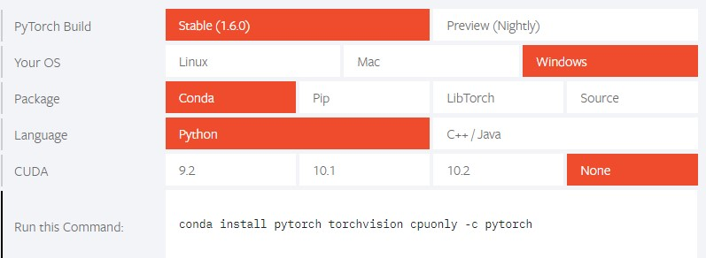
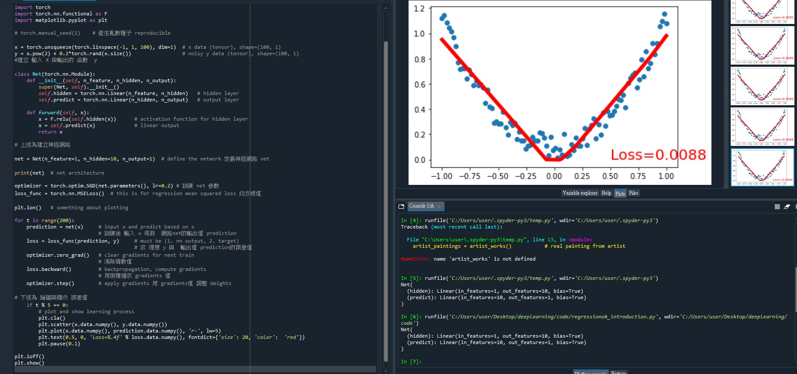

# nqucsie2020deeplearning
NQU 2020深度學習概論筆記
## pytorch
- 安裝pytorch
  - https://pytorch.org/
  - 
  - 在anaconda終端機輸入指令
## 執行程式 regressionok_introduction.py
- 使用spyder工具開啟程式碼編輯工具

- 作業 範例實作 ecamups繳交
  - 
  - regressionok_introduction.py
    ```
    # -*- coding: utf-8 -*-
    """
    # 設計 NN 完成 函數的 Regression 分析
    # 出處 https://github.com/MorvanZhou/PyTorch-Tutorial  
    #torch: 0.4
    #matplotlib
    #"""
    import torch
    import torch.nn.functional as F
    import matplotlib.pyplot as plt

    # torch.manual_seed(1)    # 產生亂數種子 reproducible

    x = torch.unsqueeze(torch.linspace(-1, 1, 100), dim=1)  # x data (tensor), shape=(100, 1)
    y = x.pow(2) + 0.2*torch.rand(x.size())                 # noisy y data (tensor), shape=(100, 1)
    #建立 輸入 X 與輸出的 函數  y  

    class Net(torch.nn.Module):
        def __init__(self, n_feature, n_hidden, n_output):
            super(Net, self).__init__()
            self.hidden = torch.nn.Linear(n_feature, n_hidden)   # hidden layer
            self.predict = torch.nn.Linear(n_hidden, n_output)   # output layer

        def forward(self, x):
            x = F.relu(self.hidden(x))      # activation function for hidden layer
            x = self.predict(x)             # linear output
            return x

    # 上述為建立神經網路

    net = Net(n_feature=1, n_hidden=10, n_output=1)  # define the network 定義神經網路 net  

    print(net)  # net architecture 

    optimizer = torch.optim.SGD(net.parameters(), lr=0.2) # 訓練 net 參數
    loss_func = torch.nn.MSELoss()  # this is for regression mean squared loss 均方根值

    plt.ion()   # something about plotting

    for t in range(200):
        prediction = net(x)     # input x and predict based on x 
                                # 訓練後 輸入 x 得到  網路net的輸出值 prediction 
        loss = loss_func(prediction, y)     # must be (1. nn output, 2. target)
                                            # 求 理想 y 與  輸出值 prediction的誤差值 
        optimizer.zero_grad()   # clear gradients for next train
                                # 清除導數值 
        loss.backward()         # backpropagation, compute gradients
                                # 用倒傳遞求 gradients 值
        optimizer.step()        # apply gradients 用 gradients值 調整 Weights   

    # 下述為 繪圖與顯示 誤差值 
        if t % 5 == 0:
            # plot and show learning process
            plt.cla()
            plt.scatter(x.data.numpy(), y.data.numpy())
            plt.plot(x.data.numpy(), prediction.data.numpy(), 'r-', lw=5)
            plt.text(0.5, 0, 'Loss=%.4f' % loss.data.numpy(), fontdict={'size': 20, 'color':  'red'})
            plt.pause(0.1)

    plt.ioff()
    plt.show()
    ```
